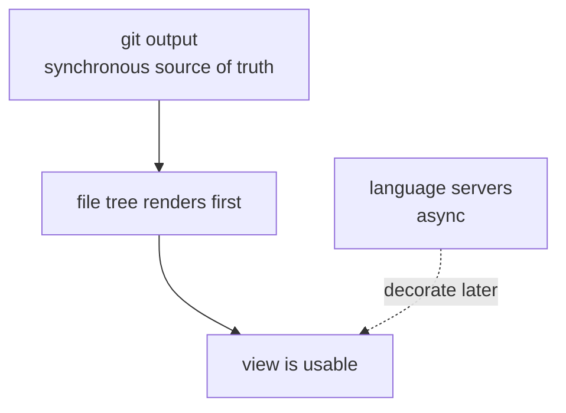

# Architecture invariant

Git output is the synchronous source of truth. The git-backed file tree renders first; diagnostics arrive later as independent async decorations over the stable tree, so the basic view stays useful while checks run.

The git-backed tree renders synchronously; diagnostics decorate it later:

