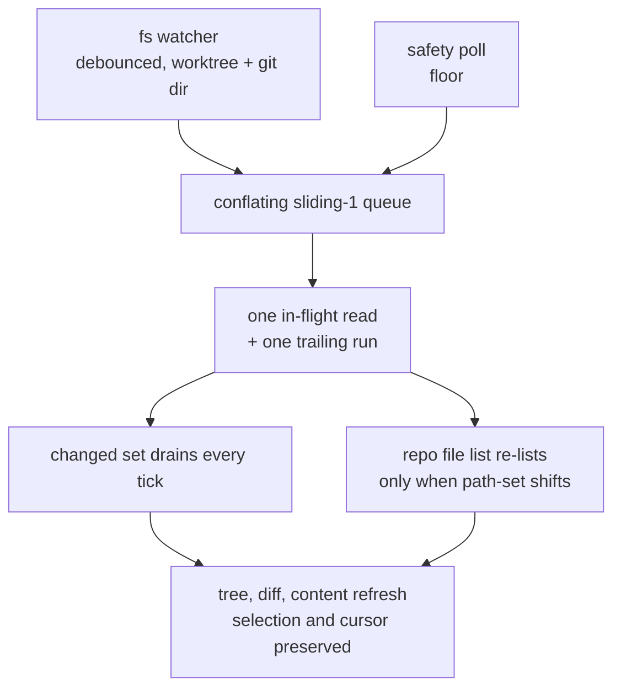

# Live view

Refresh the tree, diff, and file content while the user watches. A debounced filesystem watcher (the worktree tree plus the resolved git dir, so staging in a linked worktree is seen) re-derives git state the instant a change lands; a slow safety poll is the floor that covers anything the watcher misses, so the worst case is poll-speed, never stale. The watcher ignores high-churn git internals an agent generates while it works (loose objects, reflogs, `*.lock` files, rebase/merge scratch, `COMMIT_EDITMSG`, `FETCH_HEAD`), which never change the rendered state; staging/commit/checkout still tick via HEAD, the index, and refs, and anything wrongly filtered is still caught by the poll floor. Preserve selection by path and the cursor across refreshes; reset the cursor only on a file switch.

How a change reaches the screen:

