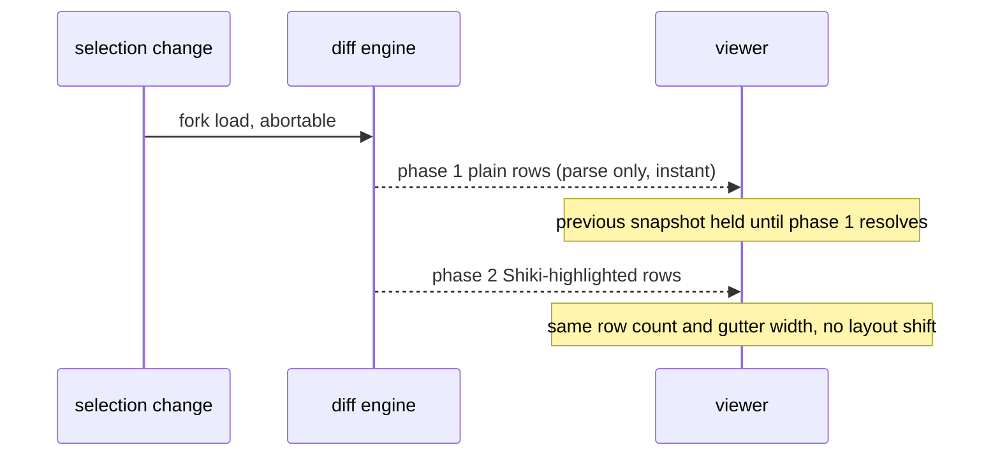

# Viewer

The diff commits in two structure-identical phases:

- Unchanged files render full content read-only. `v` toggles a changed file between diff and full content.
- Full files render through the diff viewer as synthesized all-context patches.
- Per-file diffs are computed in-process, not via `git diff <ref> -- <path>`: `fileDiffSides` (`src/git/file-patch.ts`) resolves the scope's two endpoints (a `git show <ref>:<path>` / `:<path>` blob read on each committed/indexed side, a raw worktree read on the worktree side), and jsdiff builds the git-shaped unified patch the viewer already parses. In very large repos git's pathspec-limited diff-index walks the whole index (seconds per open), while a blob read stays O(path depth). The pathspec `git diff` invocation survives only as a fallback for the cases an in-process diff can't reproduce faithfully: a side that is missing/oversized, a jsdiff timeout, one-sided CRLF (git may eol-convert the worktree before diffing), or zero hunks against non-zero numstat counts. Binary files (flagged by numstat) skip both fetches and render the model-driven placeholder; untracked files keep the existing `git diff --no-index /dev/null <path>` path.
- The diff is rendered by sideye's own windowed renderer (`src/diff/`, `src/components/diff/DiffView.tsx`) on `@pierre/diffs` (headless parse + Shiki highlight) and OpenTUI primitives, not the built-in `<diff>`. Invariants that keep it from wedging OpenTUI's scheduler: the line-number gutter is padded to a file-wide fixed width (never sized from the visible slice, so it never oscillates); only the visible row slice plus a small overscan is mounted, with top/bottom spacer boxes standing in for the off-screen rows so total scroll height is exact; in non-wrap mode each row is pinned to a single terminal row, so the spacer and `maxScrollY` math stays exact even when a grapheme (e.g. a variation-selector emoji) would otherwise lay a horizontally-clipped line out two rows tall and strand the file's last line; and each selection commits in two structure-identical phases (instant plain rows, then a Shiki-highlighted row upgrade) sharing the same row count and gutter width. Vertical scroll is the scrollbox's native scroll mirrored into the window; long lines scroll horizontally via a shared `scrollX` offset that shifts every visible line together while the gutter stays fixed (wrap mode reflows instead). Syntax covers any language Shiki bundles: a common set is warmed into the shared highlighter at startup, and a file whose language is outside that set has its grammar attached on demand (inferred from the file name) before its highlight phase, so a never-bundled language falls back to plain text without blocking the render.
- Binary, missing, and oversized files render explicit placeholders, never raw bytes. A file whose diff or content exceeds the render cap loads partially; a reserved footer row at the bottom of the viewer names the hidden-line count (`⋯ N more lines · f to load`) and `f` (or a click on the row) loads the rest. The footer is a standing property of the current file, so it lives at the content, not in the transient status bar; the row is reserved out of `viewerHeight`, so the diff never shifts under it.
- `/` opens an in-buffer find over the rendered lines: smart-case substring match (case-insensitive unless the query has an uppercase char), `n`/`N` cycle, `esc` clears, and a file switch ends it. Matches are highlighted at the line level; substring-range highlighting within a line is out of scope for v1.
- The viewer carries a **word-granular caret** on the cursor line: `h`/`l` (and `←`/`→`) hop it identifier to identifier (`src/diff/words.ts`), wrapping across line boundaries (past the last word to the next line's first, past the first to the previous line's last), and the word it owns gets a cool neutral background highlight (`markRange` in `src/diff/spans.ts`, the `caret.wordBg` token); `Tab` returns focus to the tree (`h` no longer does). The caret is stored as a **precise UTF-16 offset** (`cursorColumn`), so a diagnostic jump lands on its exact column and copy emits `path:line:col`, but motion and the highlight are word-wise. It homes to the line's first word on every vertical move (`setCursorRow`) and a content reload; a jump snaps it to the word owning the target column. A click on the line-number gutter instead selects the line with **no symbol** (`caretLineLevel`): nothing highlights and `y` copies `path:line` rather than `path:line:col`; the next caret motion or content click re-selects a symbol. Two derived signals split the concerns: `caretWord` ("is the caret on a symbol, and which") drives the highlight and the code-intel requests, while `caretColumn` (gated only by `caretLineLevel`, not by landing on a word) drives the `:col` in copy/stats — so a diagnostic jump that lands in a gap still reports its exact column. Horizontal follow keeps the caret word in view (`followScrollX`); the word highlight follows the word through wrap, but horizontal follow is scroll-mode only.
