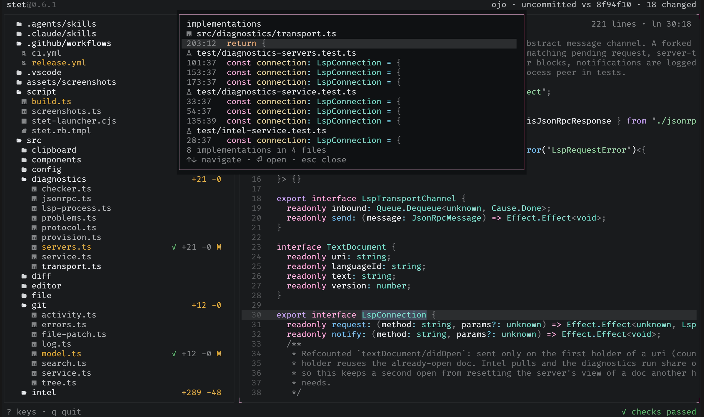
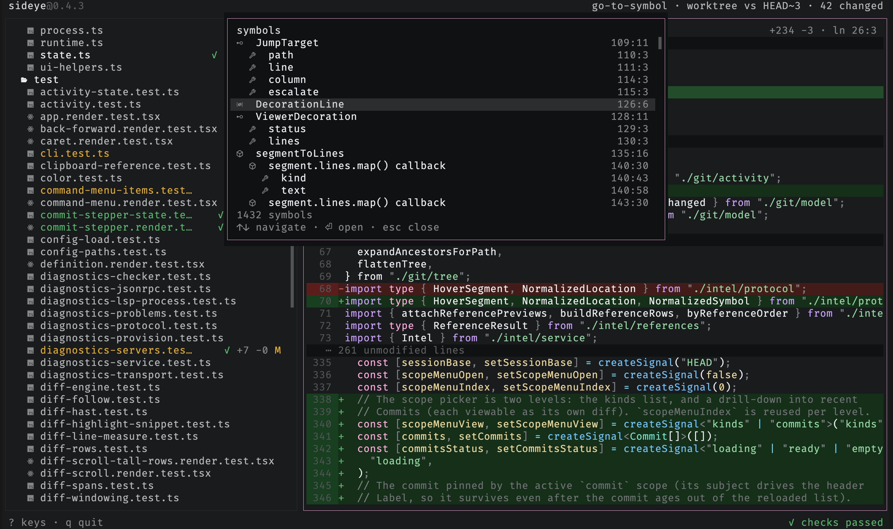

# Code intelligence

Go to definition, find references, find implementations, call hierarchy, hover,
and find symbols are read-only language-server requests over the same servers
that drive [problems](problems.md). See [languages](../reference/languages.md)
for which languages provide them (TypeScript and JavaScript today).

## Go to definition

Put the caret on a symbol and press `F12` to jump to its definition, backed by
the same language servers that drive diagnostics. A cross-file jump records your
spot, so `<` returns to the call site. When more than one definition matches (an
overloaded symbol), the targets open in a results list to pick from rather than
jumping to the first. It's a read-only LSP request, exactly like the diagnostics
it shares servers with: it never writes to the repo.

## Find references

Put the caret on a symbol and press `Shift+F12` to list everywhere it's used.
The results open in a palette-family overlay grouped by file, each row showing
`path:line:col` and its source line. `↑`/`↓` move, `enter` or a click jumps to a
result, `esc` closes. Same read-only LSP request family as go-to-definition,
over the same servers.

## Find implementations

Put the caret on an interface or abstract member and press `Shift+I` to jump past
the abstraction to its concrete bodies. A single implementation jumps straight
there; more than one opens the same overlay as find-references, grouped by file
with each row's source line, to pick from. On a plain concrete symbol the server
returns one location and it collapses to a jump. It's a read-only LSP request
over the same servers as go-to-definition, distinct from it: definition lands on
the abstract declaration, implementations land on the concrete bodies.

## Call hierarchy

Put the caret on a function or method and press `Shift+H` to list its callers in
the same overlay as find-references. `Tab` flips direction: incoming calls (who
calls this) to outgoing calls (what this calls) and back, the footer showing
which way you're looking. `↑`/`↓` move, `enter` or a click jumps to a caller or
callee, `esc` closes. It's a two-step read-only LSP request (prepare, then
resolve the edges), over the same servers as go-to-definition.

## Hover

Press `K` with the caret on a symbol to show its type and docs in a small card
anchored at the caret, the way an editor's hover does. The type signature is
syntax-highlighted with the same theme as the diff; the docs read as plain text.
The card clears as soon as you move the caret, scroll, switch files, or press
`esc`. It's the same read-only LSP request family as go-to-definition.

## Find symbols

Press `S` to list the open file's symbols in a palette-family overlay:
classes, functions, methods, and the rest, each with its kind icon and
`line:col`, nested to mirror the file's structure. `↑`/`↓` move, `enter` or a
click jumps to a symbol, `esc` closes. Unlike go-to-definition it needs no
caret, only an open file. Same read-only LSP request family, over the same
servers.

