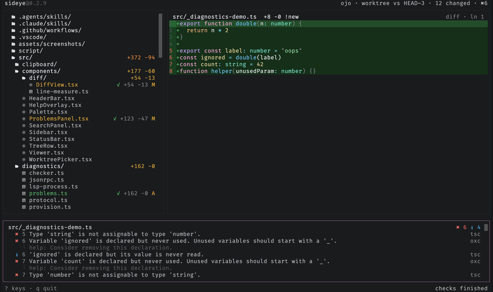

# Problems

Diagnostics from the repo's language servers stream into a problems panel as
checks finish, each tagged with its source and pinpointed to its `line:col`.
Press `p` to open it and `enter` to jump to a finding. TypeScript, oxlint, Biome,
JSON, and YAML are covered; see [languages](../reference/languages.md) for what
each language gets.

No language server installed? sideye fetches one on first use (preferring the
repo's own, then your `PATH`), so diagnostics work out of the box. Pass
`--no-lsp-download` to turn that off.

