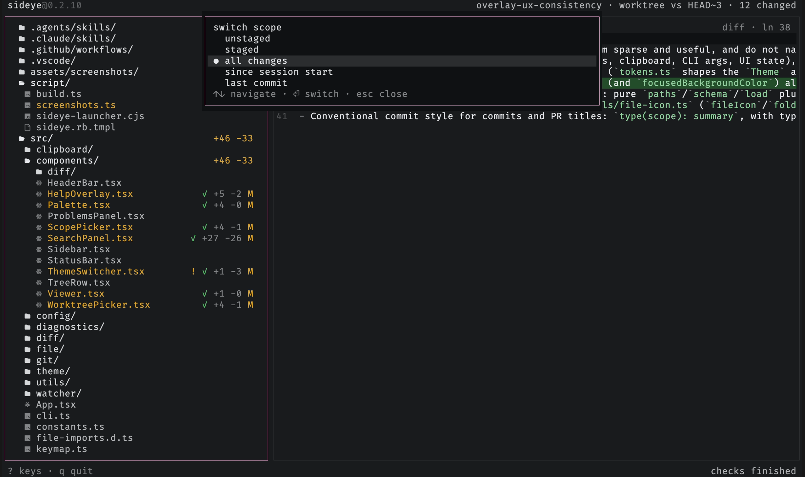

# Switch scope

Press `s` to pick what the diff compares. The scopes are grouped into changes
(uncommitted, staged, or unstaged) and history (everything since sideye launched,
or just the last commit). The picker also drills into recent commits (`commits →`),
so you can view any of them as its own diff.

