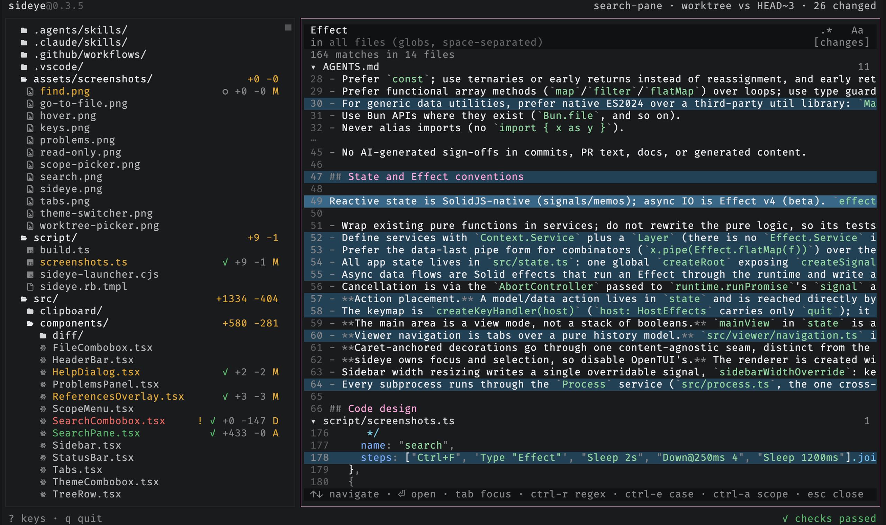

# Search file contents

Press `ctrl-f` to open the project search pane in the main viewer area. Results
group by file with syntax-highlighted context around each match; `ctrl-r`
toggles regex, `ctrl-x` toggles case sensitivity, a filter field narrows by
glob (`!` excludes, e.g. `src/ !*.test.ts`), `ctrl-g` toggles between the
changed files and the whole tree, and `ctrl-s` picks the scope without leaving
the pane. Jumping to a
match keeps your query and results, so `ctrl-f` brings them right back.

