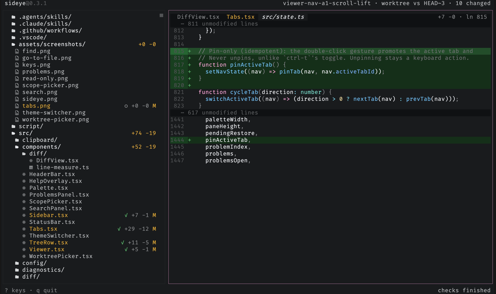

# Browse, go back, and pin tabs

Browsing the tree previews files in one calm view, so nothing piles up; the
preview shows in italic to mark it as ephemeral. `<` and `>` step back and forward
through where you've been, restoring each spot's cursor and scroll. When you want
to keep a file while you look at another, `ctrl-t` pins it as a tab (and `ctrl-t`
again unpins it), or double-click the tab or the file in the tree to pin it; `{` /
`}` switch tabs and `ctrl-w` closes one. Each tab carries its own history and
remembered position, and a tab's label is tinted by its diff status.

