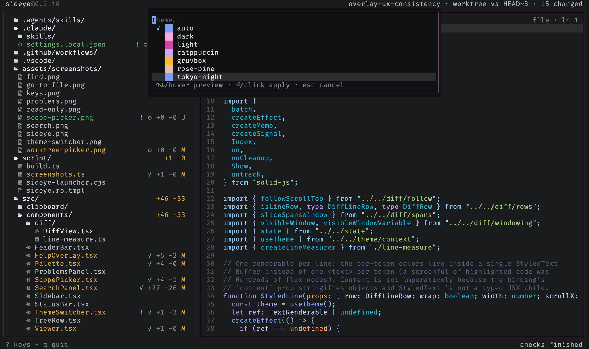

# Switch themes

Press `t` to open the theme switcher: filter by name and move (or hover) to
preview the whole UI live, `enter` to apply, `esc` to revert. The switch lasts the
session; [configuration](../reference/configuration.md) is where a theme is made
permanent.

