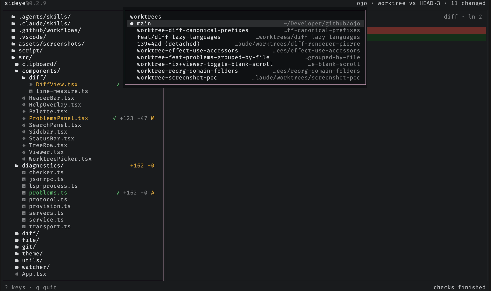

# Switch worktrees

Press `w` to jump between git worktrees without leaving the view. Type to
filter by branch or path, `↑↓` to move, `⏎` to switch. The tree, diffs,
polling, and checks all re-point at the chosen worktree.

