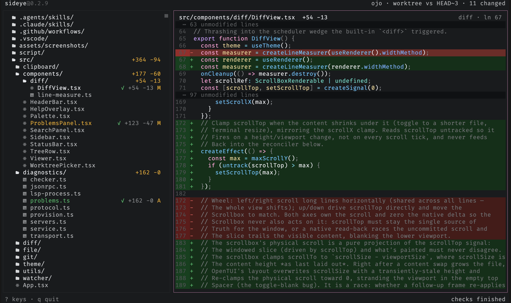

# sideye

`sideye` is a read-only companion TUI with IDE-grade insight into agent changes.

The usual workflow is awkward. The agent is in one terminal pane, but you still
open an editor just to answer basic questions:

- What files are in this repo?
- What changed?
- What did the agent touch most recently?
- Are there errors or warnings in what changed?

`sideye` is meant to sit in the next pane and answer those questions without
becoming part of the agent loop. It does not review code, approve changes, talk
to the agent, or manage a workflow. It shows you the repo, the diff, and the
problems. You decide what to say next.

## What it does

- Shows the full repo tree, including tracked files and untracked files that are
  not ignored by git.
- Marks changed files in place, with staged, unstaged, mixed, and untracked
  states.
- Opens unchanged files read-only, with syntax highlighting for any language Shiki supports.
- Opens changed files as diffs, with a toggle for the full file.
- Finds text within the open file and cycles through the matches.
- Searches file contents across the repo, scoped to the changes or the whole
  tree.
- Switches scope from a picker: all changes, staged, unstaged, everything since
  sideye launched, or just the last commit.
- Switches between git worktrees in place, re-pointing the tree, diffs,
  refresh, and checks at the chosen worktree.
- Watches the filesystem and refreshes the moment the agent changes something,
  then keeps the current file and selection stable as the view refreshes.
- Marks recent activity and lets you jump to the latest touched file.
- Shows diagnostics in the tree, in the viewer, and in a problems panel.
- Navigates code through read-only language-server pulls: go to definition, find
  references, find implementations, call hierarchy, hover for type and docs, and a
  symbol outline of the open file.
- Copies a reference and snippet to paste back into the agent conversation: the
  file `path` in the tree and `path:line:col` in the viewer (`path:line` after
  clicking a line number).

The git-backed file tree renders first. Diagnostics come in later as decorations.
That keeps the basic view useful even when checks are still running.

## Documentation

- Guide: [installation](guide/installation.md), [upgrading](guide/upgrading.md),
  [usage](guide/usage.md)
- Features: [reading files](features/reading-files.md),
  [tabs](features/tabs.md), [go to file](features/go-to-file.md),
  [find in the viewer](features/find-in-viewer.md), [search](features/search.md),
  [scopes](features/scopes.md), [worktrees](features/worktrees.md),
  [themes](features/themes.md),
  [code intelligence](features/code-intelligence.md),
  [problems](features/problems.md)
- Reference: [keybindings](reference/keybindings.md), [mouse](reference/mouse.md),
  [configuration](reference/configuration.md),
  [languages](reference/languages.md), [requirements](reference/requirements.md)
