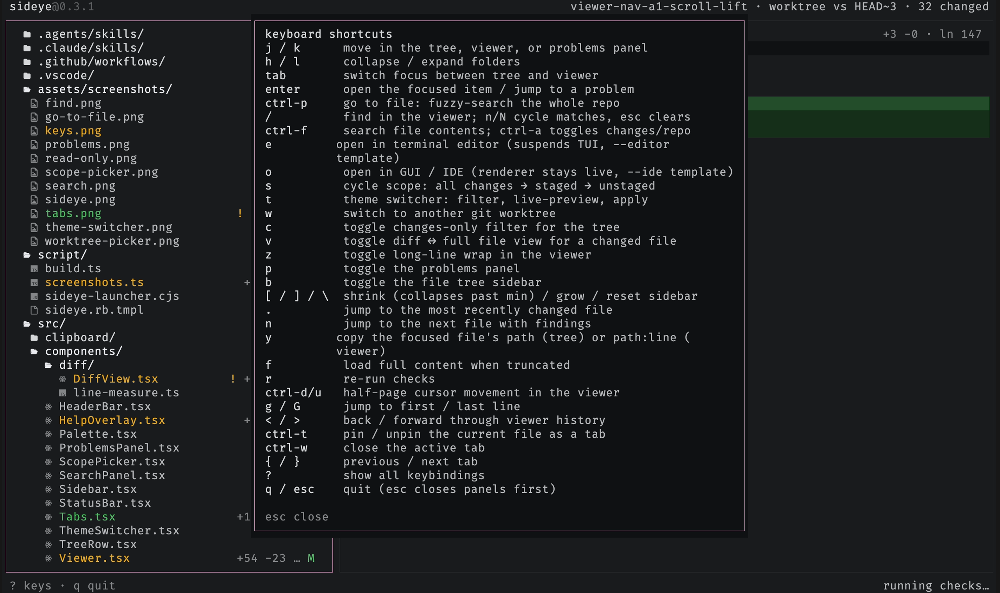

# Keybindings

## navigation

| Key       | Action                                           |
| --------- | ------------------------------------------------ |
| `j` / `k` | move in the tree, viewer, or problems panel      |
| `h` / `l` | collapse / expand folders, or word-hop the caret |
| `tab`     | switch focus between tree and viewer             |
| `enter`   | open the focused item / jump to a problem        |
| `ctrl-p`  | go to file: fuzzy-search the whole repo          |
| `.`       | jump to the most recently changed file           |
| `n`       | jump to the next file with findings              |

## viewer

| Key         | Action                                               |
| ----------- | ---------------------------------------------------- |
| `/`         | find in the viewer; `n`/`N` cycle, `esc` clears      |
| `ctrl-f`    | project search pane; regex/case/glob/scope toggles   |
| `v`         | toggle diff <-> full file view for a changed file    |
| `z`         | toggle long-line wrap in the viewer                  |
| `f`         | load full content when truncated                     |
| `ctrl-d/u`  | half-page cursor movement in the viewer              |
| `g` / `G`   | jump to first / last line                            |
| `F12`       | go to definition of the symbol under the caret       |
| `Shift+F12` | find references to the symbol under the caret        |
| `Shift+I`   | find implementations of the symbol under the caret   |
| `Shift+H`   | call hierarchy of the symbol (`Tab` flips direction) |
| `K`         | hover: type and docs for the symbol under the caret  |
| `S`         | find symbols: outline of the open file               |
| `<` / `>`   | back / forward through viewer history                |
| `y`         | copy `path`, `path:line`, or `path:line:col`         |
| `Y`         | copy the entire contents of the viewed file          |

## tabs

| Key       | Action                                |
| --------- | ------------------------------------- |
| `ctrl-t`  | pin / unpin the current file as a tab |
| `ctrl-w`  | close the active tab                  |
| `{` / `}` | previous / next tab                   |

## workspace

| Key | Action                                            |
| --- | ------------------------------------------------- |
| `s` | scope picker: kinds, or drill into recent commits |
| `t` | theme switcher: filter, live-preview, apply       |
| `w` | switch to another git worktree                    |
| `c` | toggle changes-only filter for the tree           |
| `r` | re-run checks                                     |

## layout

| Key       | Action                                            |
| --------- | ------------------------------------------------- |
| `p`       | toggle the problems panel                         |
| `ctrl-b`  | toggle the file tree sidebar                      |
| `[` / `]` | shrink / grow the sidebar (shrink past min hides) |
| `\`       | reset the sidebar to its default width            |

## app

| Key         | Action                                                 |
| ----------- | ------------------------------------------------------ |
| `e`         | open file in terminal editor (suspends TUI)            |
| `o`         | open file in GUI / IDE (renderer stays live)           |
| `Shift+F10` | context menu for the focused tree row or viewer symbol |
| `?`         | show all keybindings                                   |
| `q` / `esc` | quit (esc closes the problems panel first)             |

Press `?` anytime to see the full list in the app:

